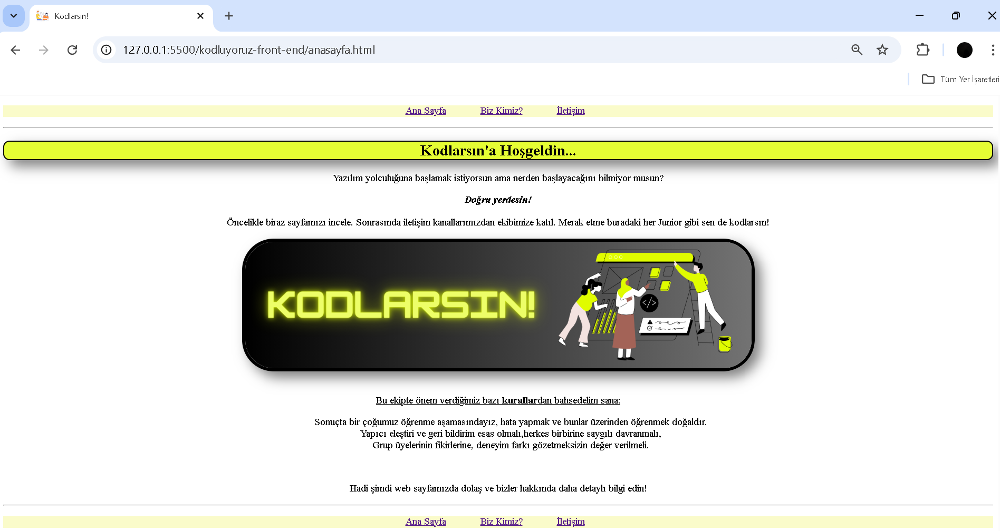

# 🎯 Kodluyoruz Front-End Eğitimi – İlk Proje

Bu proje [Kodluyoruz](https://academy.patika.dev/paths/baslangic-seviye-frontend-web-development-patikasi) Front-End eğitimi kapsamında, HTML ve CSS öğrenimini pekiştirmek amacıyla oluşturulmuştur.

## 🛠️ Kullanılan Teknolojiler

- HTML
- CSS

## 🌐 Canlı Demo

-Anasayfa: [https://frabiakaynak.github.io/kodluyoruz-front-end/](https://frabiakaynak.github.io/kodluyoruz-front-end/anasayfa.html)
-Hakkımızda: [https://frabiakaynak.github.io/kodluyoruz-front-end/](https://frabiakaynak.github.io/kodluyoruz-front-end/about-us.html)
-İletişim: [https://frabiakaynak.github.io/kodluyoruz-front-end/](https://frabiakaynak.github.io/kodluyoruz-front-end/contact.html)

## 📷 Ekran Görüntüsü

